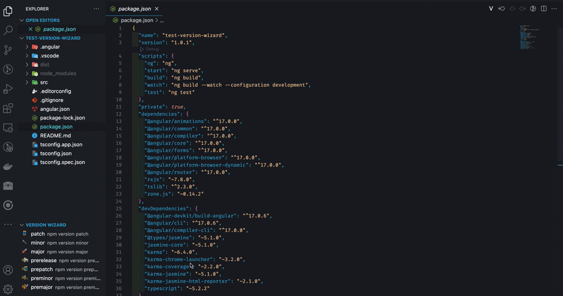
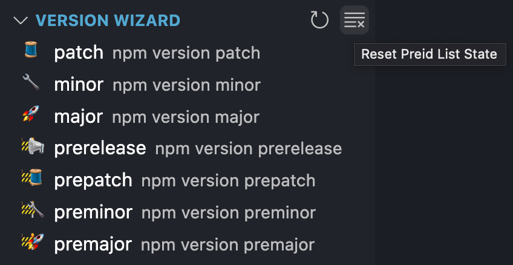

#  Version Wizard

Tired of the repetitive task of tagging and manually selecting build scripts for your projects in Visual Studio Code? Meet Version Wizard, the extension that simplifies project management and gives you full control over your build process.

## Key Features

- **Effortless Project Tagging**: Version Wizard makes project tagging a breeze. Simply open your project, head to the explorer section, and click the play button to start the tagging process.

- **Flexible Package Manager Support**: Whether you use Yarn, npm, or pnpm, Version Wizard automatically adapts to your preferred package manager, ensuring compatibility with your development setup.

- **Custom Build Script Selection**: With Version Wizard, you have the power to define and write your build scripts in your project's package.json. Then, when it's time to build, use the quick pick feature to select the desired script, tailored to your project's unique needs.

- **Manage Single Projects and Workspaces**: Whether you're working on a single project or overseeing an entire workspace, Version Wizard provides a unified solution for tagging and build script selection, streamlining your workflow.

## Getting Started

1. **Install Version Wizard**: Visit the Visual Studio Code Marketplace and install Version Wizard to streamline your project management and build process.

2. **Open Your Project or Workspace**: Launch Visual Studio Code and open the project or workspace where you want to implement Version Wizard.

3. **Navigate to Explorer Section**: In Visual Studio Code, head to the explorer section.

4. **Initiate Tagging Process**: Click the play button to initiate the tagging process seamlessly. This step is crucial for Version Wizard to enhance your project management.

5. **Define Build Scripts**: In your project's package.json, define and write your custom build scripts. This empowers you to tailor the build process according to your project's specific needs.

6. **Utilize Quick Pick Feature**: When it's time to build, leverage the quick pick feature provided by Version Wizard. This feature allows you to conveniently select the desired build script, ensuring a smooth and customized build experience.

## Demo

### Generate new tag version with build

### Generate new tag version without build

### Add new preid to history

### Remove list preid

## Installation

You can find Version Wizard on [Visual Studio Code Marketplace](https://marketplace.visualstudio.com/items?itemName=til0r.version-wizard).

## Contributing

We welcome contributions! If you have ideas or want to improve Version Wizard, read [CHANGELOG](CHANGELOG.md)

## License

This project is licensed under the MIT License - see the [LICENSE](LICENSE) file for details.

Take charge of your development process and enhance your productivity with Version Wizard. Simplify project management and build script handling like never before!
